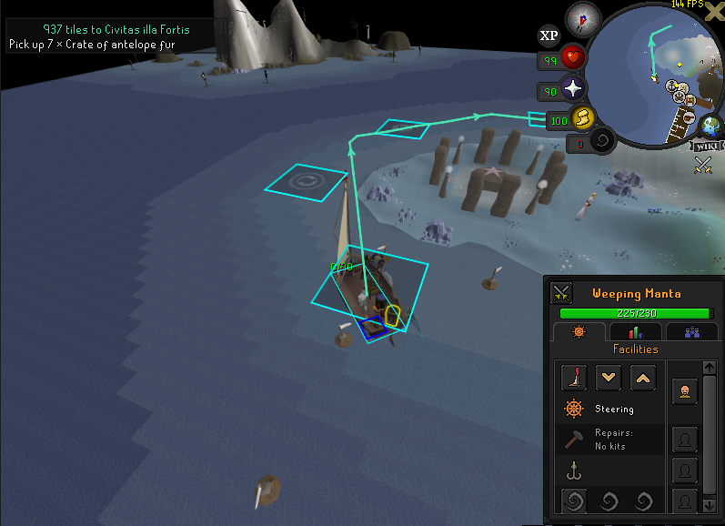
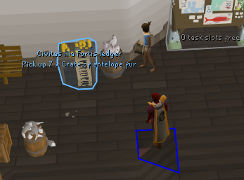
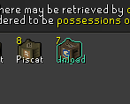
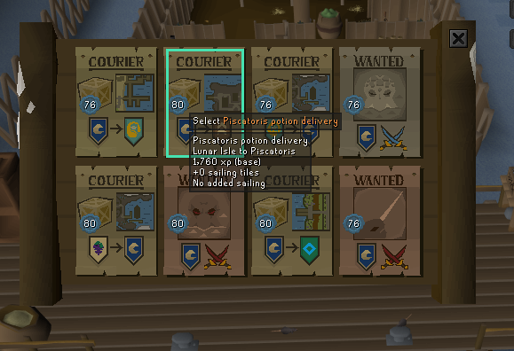

# Harbourmaster

Harbourmaster helps you choose and complete Sailing courier tasks.

- Highlights the best job or combination of jobs, taking your current tasks into account.
- Plans the optimized pickup and delivery route, with directions drawn on screen.

Recommendations compare base Sailing XP with the extra sailing distance a job adds to your route.

## Screenshots

### Sailing route

### Dock guidance

### Cargo labels

### Noticeboard recommendations

