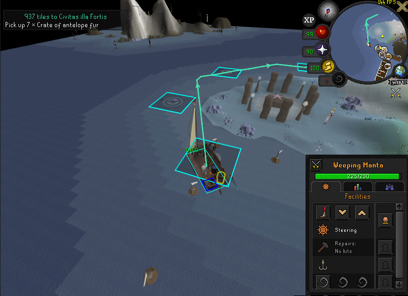
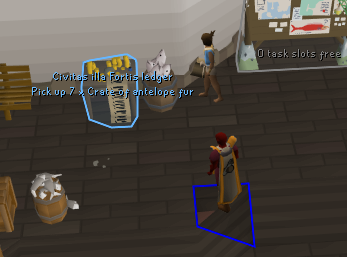
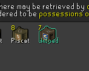
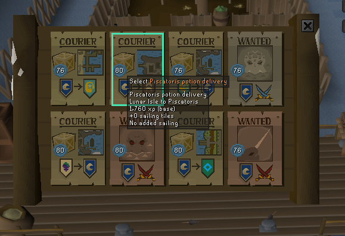

# Harbourmaster

Harbourmaster helps you earn Sailing XP efficiently from courier tasks by recommending offers and showing you what to do next.

## How to use

1. Open a Sailing noticeboard and accept the offers highlighted in green.
2. Follow the next action shown by the plugin. Highlights guide you to the noticeboard, ledger, cargo hold or gangplank you need.
3. Follow the sailing route to your next port. Cargo labels show where each crate belongs, and delivery highlights help you unload the right cargo.

Follow the displayed order at each dock. While aboard, guidance first directs you to collect delivery crates from the cargo hold. Once ashore, it may suggest accepting an offer before completing a delivery, so you can take it before the boards refresh.

Automatic guidance appears while you have courier tasks and are aboard a boat or at a dock. It stays available for 60 seconds after completing or cancelling your last task. Opening a noticeboard also activates guidance while you browse it and for 60 seconds after closing it. Leaving the boat or dock hides guidance immediately.

Recommendations account for your Sailing level, available task slots and existing tasks. Open noticeboards as you visit ports so their offers can be included in your plan. The plugin remembers those offers until the boards refresh.

At a dock with a free task slot, guidance asks you to check the noticeboard if its current offers have not been read. After reading it, guidance shows any recommended task or resumes your route.

The board label shows when to check its offers or how many tasks to accept. A gray label means you need to unload cargo first, there are no recommended tasks for the current step or there are no free task slots.

Routes use your boat, with no teleports or charters.

Route lines follow cardinal directions and 45 degree diagonals, with a preference for fewer turns. Clearance checks account for your boat's hull and turns around obstacles.

Small steering deviations keep the current route stable. A larger departure from the route triggers a new calculation.

## Settings

Choose whether to show routes in the game world, on the minimap or on the world map. Enable **Show complete route** to see future sailing legs as well as your next destination. You can also adjust highlight colours, dock guidance and cargo labels in the plugin settings.

## Screenshots

### Sailing route

### Dock guidance

### Cargo labels

### Noticeboard recommendations

